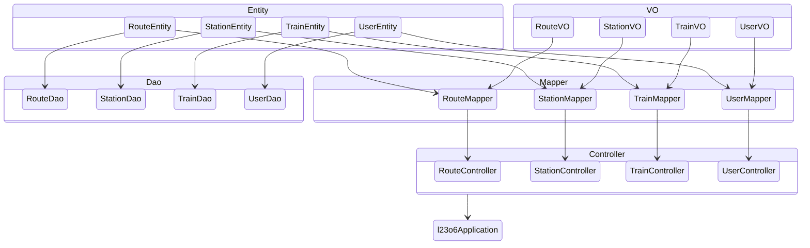
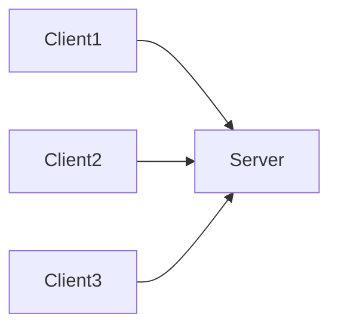
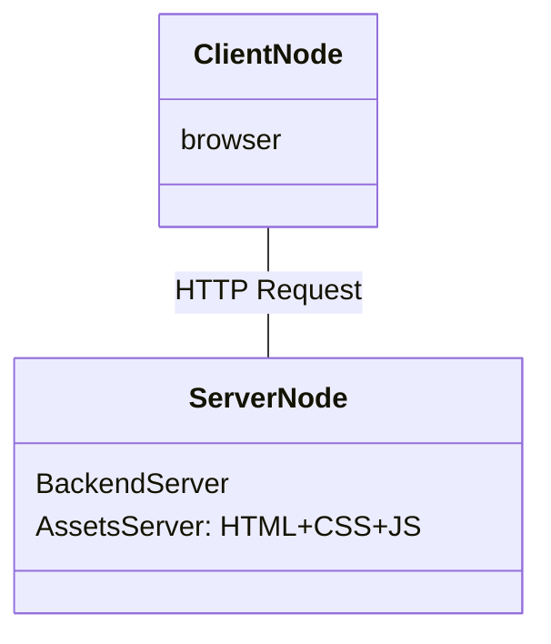

# 铁路售票系统软件体系结构描述文档


## 小组成员信息

第21组：

* 黄天宇 211250036
* 刘洋 211250037
* 汪华 211250038
* 陈凯权 211250026

<table>
  <tr>
  <td><b>修改人员</b></td>
    <td><b>日期</b></td>
    <td><b>变更原因</b></td>
    <td><b>版本号</b></td>
  </tr>
  <tr>
    <td>
    全体成员
    </td>
    <td>
      2023.5.29
    </td>
    <td>
      最初草稿
    </td>
    <td>
      v1.0.0
    </td>
  </tr>
   <tr>
    <td>
    陈凯权
    </td>
    <td>
      2023.6.1
    </td>
    <td>
     完成了数据层分解和信息视角的书写
    </td>
    <td>
      v1.0.1
    </td>
  </tr>
   <tr>
    <td>
   汪华
    </td>
    <td>
      2023.6.1
    </td>
    <td>
     完成了业务逻辑层分解的书写
    </td>
    <td>
      v1.0.2
    </td>
  </tr>
   <tr>
    <td>
    刘洋
    </td>
    <td>
      2023.6.2
    </td>
    <td>
     完成了模块职责和业务逻辑层分解的书写
    </td>
    <td>
      v1.0.3
    </td>
  </tr>
   <tr>
    <td>
    黄天宇
    </td>
    <td>
      2023.6.3
    </td>
    <td>
     完成了产品概述、逻辑视角、组合视图的书写
    </td>
    <td>
      v1.0.4
    </td>
  </tr>
   <tr>
    <td>
    刘洋
    </td>
    <td>
      2023.7.7
    </td>
    <td>
     根据lab7对开发包图和信息视角进行了修改
    </td>
    <td>
      v1.0.5
    </td>
  </tr>
</table>


## 目录

[toc]


## 1. 引言

### 1.1 编制目的

本报告详细完成对订票系统的详细设计，达到指导详细设计和开发的⽬的，同
时实现和测试⼈员及⽤户的沟通。
本报告⾯向开发⼈员、测试⼈员及最终⽤户⽽编写，是了解系统的导航。

### 1.2 参考资料

1. IEEE标准
2. 《软件工程与计算（卷二）软件开发的技术基础》
3. 铁路售票系统用例文档
4. 铁路售票系统需求规格说明文档


## 2. 产品概述

方便人们购买出行的车票，主要包括：全面的展示每趟列车的详细情况，帮助用户进行选择和比较，更好的购票；执行信用累计制度，防止恶意订票购票；让铁路局能及时了解到所有购票订单的变化动态，让系统及时更新票余量情况；帮助顾客建立历史记录，在顾客预订时发挥历史记录的作用。

## 3. 逻辑视角
&emsp;&emsp;在铁路售票系统中，选择分层体系结构风格，将系统分为3部分(presentation, businesslogic, data)能够很好地示意整个⾼层抽象。Presentation部分包含了GUI⻚⾯的实现，businesslogic部分包含业务逻辑处理的实现，data部分负责数据的持久化和访问。分层体系结构的逻辑视⻆和逻辑设计⽅案如下图所示。
<center>

  

图1 逻辑视图


 
图2 逻辑设计方案

</center>


## 4. 组合视图

### 4.1 开发包图

| 开发包                   | 依赖的其他开发包                                             |
| ------------------------ | ------------------------------------------------------------ |
| BusinessExceptionHandler |                                                              |
| OrderController          | BizError、CreateOrderRequest、OrderIdVO、OrderVO、PatchOrderRequest、OrderService、 |
| RouteController          | AddRouteRequest、RouteVO、RouteService                       |
| StationController        | AddRouteRequest、StationVO、StationService                   |
| TrainController          | AddTrainRequest、AdminTrainVO、ListTrainRequest、TrainDetailVO、TrainVO |
| UserController           | UserMapper、EditUserInfoRequest、LoginRequest、RegisterRequest、UserVO、UserService |
| HelloController          |                                                              |
| OrderDao                 | OrderEntity                                                  |
| RouteDao                 | RouteEntity                                                  |
| TrainDao                 | TrainEntity                                                  |
| StationDao               | StationEntity                                                |
| UserDao                  | UserEntity                                                   |
| OrderStatus              |                                                              |
| BizError                 |                                                              |
| OrderMapper              | OrderEntity、OrderVO                                         |
| RouteMapper              | RouteEntity,RouteVO                                          |
| StationMapper            | StationEntity,StationVO                                      |
| TrainMapper              | TrainEntity,TrainVO                                          |
| UserMapper               | UserEntity,UserVO                                            |
| OrderEntity              | OrderStatus                                                  |
| RouteEntity              |                                                              |
| StationEntity            |                                                              |
| TrainEntity              |                                                              |
| UserEntity               |                                                              |
| CreateOrderRequest       |                                                              |
| OrderIdVO                |                                                              |
| OrderVO                  |                                                              |
| PathOrderRequest         |                                                              |
| AddRouteRequest          |                                                              |
| RouteVO                  |                                                              |
| AddStationRequest        |                                                              |
| StationVO                |                                                              |
| AddTrainRequest          |                                                              |
| AdminTrainVO             |                                                              |
| LIstTrainVO              |                                                              |
| TicketInfo               |                                                              |
| TrainDetailVO            |                                                              |
| TrainVO                  |                                                              |
| EditUserInfoRequest      |                                                              |
| LoginRequest             |                                                              |
| RegisterRequest          |                                                              |
| UserVO                   |                                                              |
| PageResult               |                                                              |
| OrderServicelmpl         | OrderDao、RouteDao、TrainDao、UserDao、BizError、OrderEntity、RouteEntity、TrainEntity、UserEntity、OrderStatus、OrderVO、OrderService、PaymentContext、GSeriesSeatStrategy、KSeriesSeatStrategy |
| RouteServicelmpl         | RouteDao、TrainDao、BizError、BizError、RouteMapper、RouteEntity、TrainEntity、RouteVO、RouteService |
| TrainServicelmpl         | RouteDao、StationDao、TrainDao、BizError、StationMapper、RouteEntity、StationVO、StationService |
| UserServicelmpl          | RouteDao、TrainDao、BizError、RouteMapper、TrainMapper、RouteEntity、TrainEntity、TrainType、RouteVO、AdminTrainVO、TicketDetailVO、TrainVO、TrainService、GSeriesSeatStrategy、KSeriesSeatStrategy |
| PaymentContext           | BizError                                                     |
| GSeriesSeatStrategy      |                                                              |
| KSeriesSeatStrategy      |                                                              |
| L23o6Application         |                                                              |




### 4.2 运行时进程




### 4.3 物理部署




## 5. 架构设计

### 5.1 模块职责

客户端模块和服务器模块试图分别如图5.1-1和图5.1-2所示。客户端各层和服务器端各层的职责分别如表5.1-1和表5.1-2所示。

<center>
  5.1-1 图
</center>


<center>
  5.1-2 图
</center>


<center>5.1-1 客户端各层的职责</center>


<table>
  <tr>
  <td><div  align='center'>
    层</div></td>
  <td><div  align='center'>
    职责</div></td></tr>
  <tr>
  <td><div  align='center'>
    启动模块</div></td>
  <td><div  align='center'>
    负责初始化网络通信机制，启动用户界面</div></td></tr>
  <tr>
  <td><div  align='center'>
    用户界面层</div></td>
  <td><div  align='center'>
    基于窗口的铁路售票系统用户界面</div></td></tr>
  <tr>
  <td><div  align='center'>
    业务逻辑层</div></td>
  <td><div  align='center'>
    对于用户界面的输入响应和业务处理逻辑</div></td></tr>
  <tr>
  <td><div  align='center'>
    客户端网络模块</div></td>
  <td><div  align='center'>
    利用Java RMI机制查找RMI服务</div></td></tr>
</table>


<center>5.1-2 服务器端各层的职责</center>  


<table>
  <tr>
  <td><div  align='center'>
    层</div></td>
  <td><div  align='center'>
    职责</div></td></tr>
  <tr>
  <td><div  align='center'>
    启动模块</div></td>
  <td><div  align='center'>
    负责初始化网络通信机制，启动用户界面</div></td></tr>
  <tr>
  <td><div  align='center'>
    数据层</div></td>
  <td><div  align='center'>
    负责数据的持久化及数据访问接口</div></td></tr>
  <td><div  align='center'>
    服务器端网络模块</div></td>
  <td><div  align='center'>
    利用Java RMI机制开启RMI服务，注册RMI服务</div></td></tr>
</table>


每一层只是使用下方直接接触的层。层与层之间仅仅是通过接口的调用来完成的。层之间调用的接口如5.1-3所示。

<center>
  5.1-3 层之间调用的接口
</center>


<table>
  <tr>
  <td><div  align='center'>
    接口</div></td>
  <td><div  align='center'>
    服务调用方</div></td>
    <td><div  align='center'>
    服务提供方</div></td>
  </tr>
  <tr>
  <td><div  align='center'>
    railwayblservice<br>
    userblservice<br>
    orderblservice<br>
    promotionblservice</div></td>
  <td><div  align='center'>
    客户端展示层</div></td>
    <td><div  align='center'>
    客户端业务逻辑层</div></td>
  </tr>
  </tr>
  <tr>
  <td><div  align='center'>
    railwaydataservice<br>
    userdataservice<br>
    orderdataservice<br>
    promotiondataservice</div></td>
  <td><div  align='center'>
    客户端业务逻辑层</div></td>
    <td><div  align='center'>
    服务器端数据层</div></td>
  </tr>
</table>


### 5.2 用户界面层分解

根据需求，系统存在15个用户界面：登录界面、客户注册界面、搜索车票、车票详情、购买车票、订单详情、订单管理、评分评价、客户信息、铁路管理人员主页面、铁路信息管理、车票信息管理、车票促销策略管理、信用充值、用户管理。

界面跳转图如5.2-1所示


<center>
  5.2-1 图
</center>


用户界面类如图5.2-2所示

<center>
  5.2-2 图
</center>


#### 5.2.1 用户界面层模块的职责

用户界面层模块的职责如表5.2.1-1所示

<center>
  5.2.1-1 用户界面层模块的职责
</center>


<table>
  <tr><td><div align='center'>
    模块</div></td>
    <td><div align='center'>
      职责</div></td>
    </tr>
  <tr><td><div align='center'>
   MainUIController</div></td>
    <td><div align='center'>
      界面Frame，负责界面的显示和跳转</div></td>
    </tr>
</table>


#### 5.2.2 用户界面层模块的接口规范

用户界面层模块的接口规范如表5.2.2-1所示

<center>
  5.2.2-1 用户界面层模块的接口规范
</center>


<table>
  <tr><td rowspan = '3'><div align='center'>
    MainFrame</div></td>
    <td><div align='center'>
      语法</div></td>
    <td><div align='center'>showMainView()</div>
    </td>
    </tr>
  <tr><td><div align='center'>前置条件</div>
    </td>
  <td><div align='center'>
    无</div></td></tr>
  <tr><td><div align='center'>后置条件</div>
    </td>
  <td><div align='center'>
    显示rootPane</div></td></tr>
</table>


  用户界面层需要的服务接口如表5.2.2-2所示

<center>
  5.2.2-2 用户界面层需要的服务接口
</center>


<table>
  <tr><td><div align='center'>
    服务名</div></td>
    <td><div align='center'>
      服务</div></td>
    </tr>
  <tr><td><div align='center'>
  Businesslogicservice.LoginBLService</div></td>
    <td><div align='center'>
      登录界面的业务逻辑接口</div></td>
    </tr>
  <tr><td><div align='center'>
  Businesslogicservice.*BLService</div></td>
    <td><div align='center'>
      每个界面都有一个相应的业务逻辑接口</div></td>
    </tr>
</table>


#### 5.2.3 用户界面层模块设计原理

用户界面利用Vue.js框架实现


### 5.3 业务逻辑层分解

#### 5.3.1 业务逻辑层模块的职责  
<br>
<table>
  <tr>
  <td><div  align='center'>
    模块</div></td>
  <td><div  align='center'>
    职责</div></td>
  </tr>
  <tr>
  <td><div  align='center'>
    orderbl</div></td>
  <td><div  align='center'>
    负责实现订单需要的服务</div></td>
  </tr>
  <tr>
  <td><div  align='center'>
    routebl</div></td>
  <td><div  align='center'>
    负责实现线路需要的服务</div></td>
  </tr>
    <tr>
  <td><div  align='center'>
    stationbl</div></td>
  <td><div  align='center'>
    负责实现站点需要的服务</div></td>
  </tr>
    <tr>
  <td><div  align='center'>
    trainbl</div></td>
  <td><div  align='center'>
    负责实现列车需要的服务</div></td>
  </tr>
    <tr>
  <td><div  align='center'>
    userbl</div></td>
  <td><div  align='center'>
    负责实现用户需要的服务</div></td>
  </tr>
</table>
<br>

#### 5.3.2业务逻辑层模块的接口规范
<br>
<center> 5.3.2-1 orderbl 模块的接口规范  </center>
<table>
  <tr>
    <td>服务名</td>
    <td>语法</td>
    <td>前置条件</td>
    <td>后置条件</td>
  </tr>
  <tr>
    <td>OrderblService.checkCredit</td>
    <td>public ResultMessage checkCredit()</td>
    <td>用户已登录</td>
    <td>返回信用值是否足以购票</td>
  </tr>
  <tr>
    <td>OrderblService.startOrder</td>
    <td>public ResultMessage startOrder(OrderVO order)</td>
    <td>用户信用值足以购票</td>
    <td>返回是否成功开启订单</td>
  </tr>
  <tr>
    <td>OrderblService.generateOrder</td>
    <td>public ResultMessage generateOrder()</td>
    <td>用户已经开启订单</td>
    <td>生成订单，更新数据</td>
  </tr>
</table>
<br>
<center> 5.3.2-2 routebl 模块的接口规范 </center>
<table>
  <tr>
    <td>服务名</td>
    <td>语法</td>
    <td>前置条件</td>
    <td>后置条件</td>
  </tr>
  <tr>
    <td>RouteblService.searchRoute</td>
    <td>public RouteVO searchRoute (SearchCond RouteMsg)</td>
    <td>用户选择了合法的检索条件</td>
    <td>返回对应线路信息</td>
  </tr>
  <tr>
    <td>RouteblService.getRoute</td>
    <td>public RouteVO getRoute (String RouteID)</td>
    <td>用户输入了合法的线路ID</td>
    <td>返回对应线路信息</td>
  </tr>
  <tr>
    <td>RouteblService.upgrateRoute</td>
    <td>public ResultMessage (RouteVO rv)</td>
    <td>管理员更新线路信息</td>
    <td>返回是否更新成功</td>
  </tr>
  <tr>
    <td>RouteblService.addRoute</td>
    <td>public ResultMessage (RouteVO rc)</td>
    <td>管理员添加线路信息</td>
    <td>返回是否添加成功</td>
  </tr>
  <tr>
    <td>RouteblService.deleteRoute</td>
    <td>public ResultMessage (String RouteID)</td>
    <td>管理员删除线路信息</td>
    <td>返回是否删除成功</td>
  </tr>
  <tr>
    <td>RouteblService.getTrains</td>
    <td>public ArrayList&lt;TrainVO&gt; getTrains(String RouteID)</td>
    <td>用户输入了合法的线路ID</td>
    <td>返回对应线路里的对应火车</td>
  </tr>
  <tr>
    <td>RouteblService.getStations</td>
    <td>public ArrayList&lt;StationVO&gt; getStations(String RouteID)</td>
    <td>用户输入了合法的线路ID</td>
    <td>返回对应线路经过的站点</td>
  </tr>
</table>
<br>
<center> 5.3.2-3 stationbl 模块的接口规范 </center>
<table>
  <tr>
    <td>服务名</td>
    <td>语法</td>
    <td>前置条件</td>
    <td>后置条件</td>
  </tr>
  <tr>
    <td>StaionblService.searchStation</td>
    <td>public StaionVO searchStation (searchCond sc)</td>
    <td>用户选择了合法的检索条件</td>
    <td>返回符合条件的站点信息</td>
  </tr>
  <tr>
    <td>StaionblService.getStation</td>
    <td>public StationVO getStation (String StationID)</td>
    <td>用户输入了合法的站点编号</td>
    <td>返回对应的站点信息</td>
  </tr>
  <tr>
    <td>StationblService.upgrateStation</td>
    <td>public ResultMessage upgrateStation(StationVO sv)</td>
    <td>管理员更新站点信息</td>
    <td>返回是否成功更新站点信息</td>
  </tr>
  <tr>
    <td>StationblService.addStation</td>
    <td>public ResultMessage addStation(StationVO sv)</td>
    <td>管理员添加站点信息</td>
    <td>返回是否成功添加站点信息</td>
  </tr>
  <tr>
    <td>StationblService.deleteStation</td>
    <td>public ResultMessage deleteStation(String StationID)</td>
    <td>管理员删除站点信息</td>
    <td>返回是否成功添加站点信息</td>
  </tr>
  <tr>
    <td>StationblService.getRoutes</td>
    <td>public ArrayList&lt;RouteVO&gt; getRoutes(String StationID)</td>
    <td>用户输入合法的站点ID</td>
    <td>返回经过对应站点的线路信息</td>
  </tr>
</table>
<center> 5.3.2-4 trainbl 模块的接口规范 </center>
<table>
  <tr>
    <td>服务名</td>
    <td>语法</td>
    <td>前置条件</td>
    <td>后置条件</td>
  </tr>
  <tr>
    <td>TrainblService.searchTrain</td>
    <td>public ArrayList&lt;TrainVO&gt; searchTrain (searchCond sc)</td>
    <td>用户选择了合法的检索条件</td>
    <td>返回符合条件的火车信息</td>
  </tr>
  <tr>
    <td>TrainblService.getTrain</td>
    <td>public TrainVO getTrain(String TrainID)</td>
    <td>用户输入了合法的火车编号</td>
    <td>返回对应的火车信息</td>
  </tr>
  <tr>
    <td>TrainblService.upgrateTrain</td>
    <td>public ResultMessage upgrateTrain(TrainVO tv)</td>
    <td>管理员更新火车信息</td>
    <td>返回是否修改成功</td>
  </tr>
  <tr>
    <td>TrainblService.addTrain</td>
    <td>public ResultMessage addTrain(TrainVO tv)</td>
    <td>管理员添加火车信息</td>
    <td>返回是否添加成功</td>
  </tr>
  <tr>
    <td>TrainblService.deleteTrain</td>
    <td>public ResultMessage deleteTrain(String TrainID)</td>
    <td>管理员删除火车信息</td>
    <td>返回是否删除成功</td>
  </tr>
  <tr>
    <td>TrainblService.getRoute</td>
    <td>public RouteVO getRoute(String TrainID)</td>
    <td>用户输入合法的火车编号</td>
    <td>返回火车隶属的线路</td>
  </tr>
  <tr>
    <td>TrainblService.getStations</td>
    <td>public ArrayList&lt;StationVO&gt; getStations(String TrainID)</td>
    <td>用户输入合法的火车编号</td>
    <td>返回火车经过的站点</td>
  </tr>
</table>
<center> 5.3.2-5 userbl 模块的接口规范 </center>
<table>
  <tr>
    <td>服务名</td>
    <td>语法</td>
    <td>前置条件</td>
    <td>后置条件</td>
  </tr>
  <tr>
    <td>UserblService.login</td>
    <td>public LoginState login(String username, String password)</td>
    <td>已经开启登录</td>
    <td>更新登录状态</td>
  </tr>
  <tr>
    <td>UserblService.logout</td>
    <td>public LoginState logout()</td>
    <td>用户已经登录</td>
    <td>更新登录状态</td>
  </tr>
  <tr>
    <td>UserblService.resetPassword</td>
    <td>public ResultMessage resetPassword(String username, String oldPassword, String newPassword)</td>
    <td>用户已经登录</td>
    <td>返回是否成功更改密码</td>
  </tr>
  <tr>
    <td>UserblService.add</td>
    <td>public ResultMessage add(ClientVO cv)</td>
    <td>已经开启增加用户</td>
    <td>调用Client里的addClient方法</td>
  </tr>
  <tr>
    <td>UserblService.delete</td>
    <td>public ResultMessage delete(String userID)</td>
    <td>已经开启删除用户</td>
    <td>调用Client里的deleteClient方法</td>
  </tr>
  <tr>
    <td>UserblService.upgrate</td>
    <td>public ResultMessage upgrate(ClientVO cv)</td>
    <td>已经开启更新用户</td>
    <td>调用Client里的upgrateClient方法</td>
  </tr>
  <tr>
    <td>UserblService.getUser</td>
    <td>public ClientVO getUser(String userID)</td>
    <td>输入合法的ID</td>
    <td>调用Client里的getClient方法</td>
  </tr>
  <tr>
    <td>UserblService.upgrateCreditRecord</td>
    <td>public ResultMessage upgrateCreditRecord(String userID, CreditVO cv)</td>
    <td>已经开启更新信用值</td>
    <td>调用Client里的upgrateCredit方法</td>
  </tr>
  <tr>
    <td>UserblService.getCreditRecord</td>
    <td>public CreditVO getCreditRecord(String userID)</td>
    <td>已经开启查看信用值</td>
    <td>调用Client里的getCredit方法</td>
  </tr>
</table>


### 5.4 数据层分解

数据层主要给业务逻辑层提供数据访问服务，包括对于持久化数据的增、删、改、查。

#### 5.4.1 数据层模块的职责

Order、Route、Station、Train、User等业务逻辑需要的服务分别由OrderDao、RouteMapper/RouteDao/RouteService、StationMapper/StationDao/StationService、TrainMapper/TrainDao/TrainService、UserMapper/UserDao/UserService接口提供，不过在本次提供代码中，Mapper/Dao更多是起到数据传输职责，将数据的增删改查实现交由Service去具体实现，本质是对Mapper/Dao数据接口的处理再返回。对于库存模块和销售模块仿照上述结构进行设计并提供对应接口。

Mapper调用Entity层，将Entity实体中的数据传输到对应VO对象中用于业务层间传递。


Dao执行与数据库的交互，需求第一阶段主要使用save，find实现数据的增改查，并未对删除操作做出需求和相关用例。

| 模块 | 职责 |
| ---- | ---- |
| OrderDao | 持久化数据库接口，提供订单信息 |
| RouteDao | 持久化数据库接口，提供路线信息 |
| StationDao | 持久化数据库接口，提供站点信息 |
| TrainDao | 持久化数据库接口，提供列车信息 |
| UserDao | 持久化数据库接口，提供用户信息 |


Service负责从Dao层接收数据并对数据增改查行为提供服务。

| 模块 | 职责 |
| ---- | ---- |
| RouteService | 提供路线信息增改查服务 |
| StationService | 提供站点信息增改查服务 |
| TrainService | 提供列车信息增改查服务 |
| UserService | 提供用户登录验证，信息注册，查找，修改服务 |
| OrderService | 提供订单信息，进行销售，对余票信息进行更新查看 |


#### 5.4.2 数据层模块的接口规范

鉴于主要操作集中于service模块，对service模块接口规范进行详细描述。

##### RouteService模块的接口规范

| 接口名称 | 语法 | 前置条件 | 后置条件 |
| ---- | ---- | ---- | ---- |
| RouteService.addRoute | void addRoute(String name, List<Long> stationIds); | 数据库中不存在相同名称route | 在数据库中增加一条Route信息 |
| RouteService.listRoutes | List<RouteVO> listRoutes(); | 无 | 返回所有铁路信息 |
| RouteService.getRoute | RouteVO getRoute(Long id); | 无 | 存在该id对应信息则返回对应铁路信息，不存在返回不存在信息 |
| RouteService.editRoute | void editRoute(Long id, String name, List<Long> stationIds); | 数据库中已有相同id的Route信息 | 编辑更新route信息 |

##### StationService模块的接口规范

| 接口名称 | 语法 | 前置条件 | 后置条件 |
| ---- | ---- | ---- | ---- |
| StationService.getStation | StationVO getStation(Long stationId); | 无 | 存在该id对应信息则返回对应站点信息，不存在返回不存在信息 |
| StationService.listStations() | List<StationVO> listStations(); | 无 | 返回所有站点信息 |
| StationService.addStation | void addStation(String name); | 数据库中不存在相同名称station | 在数据库中增加一条station信息 |
| StationService.editStation | void editStation(Long stationId, String name); | 数据库中已有相同stationId的station信息 | 编辑更新station信息 |

##### TrainService模块的接口规范

| 接口名称 | 语法 | 前置条件 | 后置条件 |
| ---- | ---- | ---- | ---- |
| TrainService.getTrain | TrainDetailVO getTrain(Long trainId); | 无 | 存在该trainId对应信息则返回对应列车信息，不存在返回不存在信息 |
| TrainService.listTrains | List<TrainVO> listTrains(Long startStationId, Long endStationId, String date); | 无 | 返回所有对应起始站点以及相应时间内的列车 |
| TrainService.listTrainsAdmin | List<AdminTrainVO> listTrainsAdmin(); | 无 | 返回列车管理员信息 |
| TrainService.addTrain | void addTrain(String name, Long routeId, String type, String date, List<Date> arrivalTimes, List<Date> departureTimes); | 数据库中不存在相同名称和routeId的列车 | 向数据库中增加一条train信息 |
| TrainService.update | void update(OrderEntity orderEntity); | 已成功支付 | 对train对象中的seats进行更新，从而更新余票信息 |

##### UserService模块的接口规范

| 接口名称 | 语法 | 前置条件 | 后置条件 |
| ---- | ---- | ---- | ---- |
| UserService.login | void login(String username, String password); | 数据库中存在该用户信息 | 登录 |
| UserService.register | void register(String username, String password, String name, String idn, String phone, String type); | 数据库中不存在该用户信息 | 注册账号，更新用户数据库表信息 |
| UserService.findByUserName | UserEntity findByUserName(String username); | 无 | 存在该用户名对应信息则返回对应user信息，不存在返回不存在信息 |
| UserService.editInfo | void editInfo(String username, String name, String idn, String phone, String type); | 数据库中已有该user信息/用户已登录 | 编辑更新user信息 |

##### OrderService模块的接口规范

| 接口名称 | 语法 | 前置条件 | 后置条件 |
| ---- | ---- | ---- | ---- |
| OrderService.addOrder | void addOrder(Long id, Long userId, Long trainId, Long departureStationId, Long arrivalStationId); | 余票充裕 | 新增订单存入数据库，更新列车座位情况 |
| OrderService.getOrder | OrderVO getOrder(Long id); | 数据库中存在该订单信息 | 返回对应订单的信息 |
| OrderService.deleteOrder | void deleteOrder(Long id); | 数据库中存在该已支付订单且在退票期限内 | 数据库中将该条记录状态更改为“已取消”，更新数据库中余票信息 |
| OrderService.changeOrder | void changeOrder(Long oldId, Long id, Long userId, Long trainId, Long departureStationId, Long arrivalStationId); | 存在旧订单且满足改签条件 | 将先前记录状态更改为已取消，创建新的订单，更新数据库中余票信息 |

## 6. 信息视角

- 描述数据持久化对象(PO)：系统的PO类就是对应的相关的实体类，在本实验代码中使用entity表示，在此只做简单的介绍。

### 6.1 OrderEntity

| 属性 | 定义 | 类型 |
| ---- | ---- | ---- |
| id | 订单编号 | Long |
| userId | 用户编号 | Long |
| trainId | 列车编号 | Long |
| departureStationId | 起始站编号 | Long |
| arrivalStationId | 终点站编号 | Long |
| status | 订单状态 | OrderStatus |
| seat | 座位 | String |
| createdAt | 订单建立时间 | Date |
| updatedAt | 订单状态更新时间 | Date |
| whether_use_points | 是否使用积分 | Boolean |
| paymentType | 支付方式 | String |
| amount | 价格 | Double |
| originAmount | 初始价格 | Double |
| remainPoints | 剩余积分 | Long |

### 6.2 RouteEntity

| 属性 | 定义 | 类型 |
| ---- | ---- | ---- |
| id | 路线编号 | Long |
| name | 路线名称 | String |
| stationIds | 路线中包括的站点 | `List<Long>` |
| createdAt | 路线建立时间 | Date |
| updatedAt | 路线更新时间 | Date |

### 6.3 StationEntity

| 属性 | 定义 | 类型 |
| ---- | ---- | ---- |
| id | 站点编号 | Long |
| name | 站点名称 | String |
| createdAt | 站点创建时间 | Date |
| updatedAt | 站点更新时间 | Date |

### 6.4 TrainEntity

| 属性 | 定义 | 类型 |
| ---- | ---- | ---- |
| id | 列车编号 | Long |
| name | 列车名称 | String |
| routedId | 线路编号 | Long |
| seats | 座位占有情况 | boolean[][] |
| trainType | 列车类型 | TrainType |
| date | 发车日期 | String |
| arrivalTimes | 到站时间 | `List<Date>` |
| departureTimes | 出发时间 | `List<Date>` |
| extraInfos | 备注信息 | `List<String>` |
| createdAt | 列车信息创建时间 | Date |
| updatedAt | 列车信息更新时间 | Date |

### 6.5 UserEntity

| 属性 | 定义 | 类型 |
| ---- | ---- | ---- |
| id | 用户id | Long |
| username | 用户名 | String |
| password | 用户密码 | String |
| name | 姓名 | String |
| phone | 联系方式 | String |
| type | 用户身份类型 | String |
| idn | 证件号码 | String |
| createdAt | 用户信息创建日期 | Date |
| updatdAt | 用户信息更新日期 | Date |
| points | 积分 | Long |

以UserEntity类为例，定义如下所示：
```java
@Entity
@Table(name = "user1")  // table name "user" is a reserved word in H2
@Data
@Builder
@AllArgsConstructor
@NoArgsConstructor
@Accessors(chain = true)
public class UserEntity {

    @Id
    @GeneratedValue(strategy = GenerationType.IDENTITY)
    private Long id;

    @NotNull
    @Column(unique = true)
    private String username;
    @NotNull
    private String password;

    private String name;
    private String phone;
    private String type;
    private String idn;

    @CreationTimestamp
    private Date createdAt;

    @UpdateTimestamp
    private Date updatedAt;
}
```

### 6.6 数据库表

数据库中包含order_entity、route_entity、station_entity、train_entity、user1表。

数据库表结构：

#### order_entity

| id     | arrival_station_id | created_at             | departure_station_id | seat                 | status               | train_id | updated_at   | user_id  |
| ------ | ------------------ | ---------------------- | -------------------- | -------------------- | -------------------- | -------- | ------------ | -------- |
| bigint | timestamp(6)       | character varying(255) | bigint               | charactervaring(255) | charactervaring(255) | bigint[] | timestamp(6) | bigint[] |


#### route_entity

| id | created_at | name | station_ids | updated_at |
| --- | --- | --- | --- | --- |
| bigint | timestamp(6) | character varying(255) | bigint[] | timestamp(6) |


#### station_entity

| id | created_at | name | updated_at |
| --- | --- | --- | --- |
| bigint | timestamp(6) | character varying(255) | timestamp(6) |

#### train_entity

| id | arrival_times | created_at | date | departure_times | extra_infos | name | route_id | seats | train_type | updated_at |
| --- | --- | --- | --- | --- | --- | --- | --- | --- | --- | --- |
| bigint | timestamp(6) | timestamp(6) | character varying(255) | timestamp(6) | character varying(255)[] | character varying(255) | bigint | boolean[] | smallint | timestamp(6) |

#### user1

| id | created_at | idn | name | password | phone | type | update_at | username |
| --- | --- | --- | --- | --- | --- | --- | --- | --- |
| bigint | timestamp(6) | character varying(255) | character varying(255) | character varying(255) | character varying(255) | character varying(255) | timestamp(6) | character varying(255) |