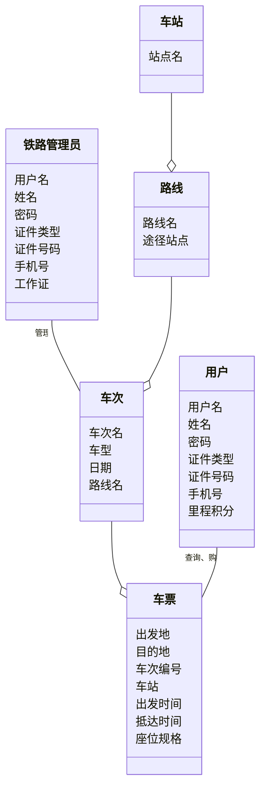
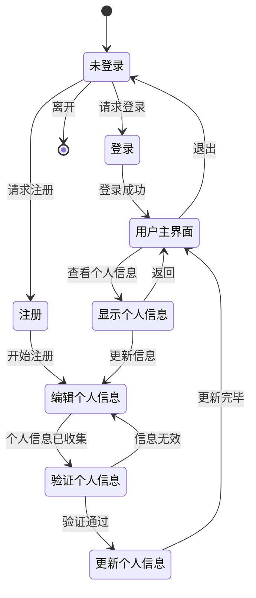
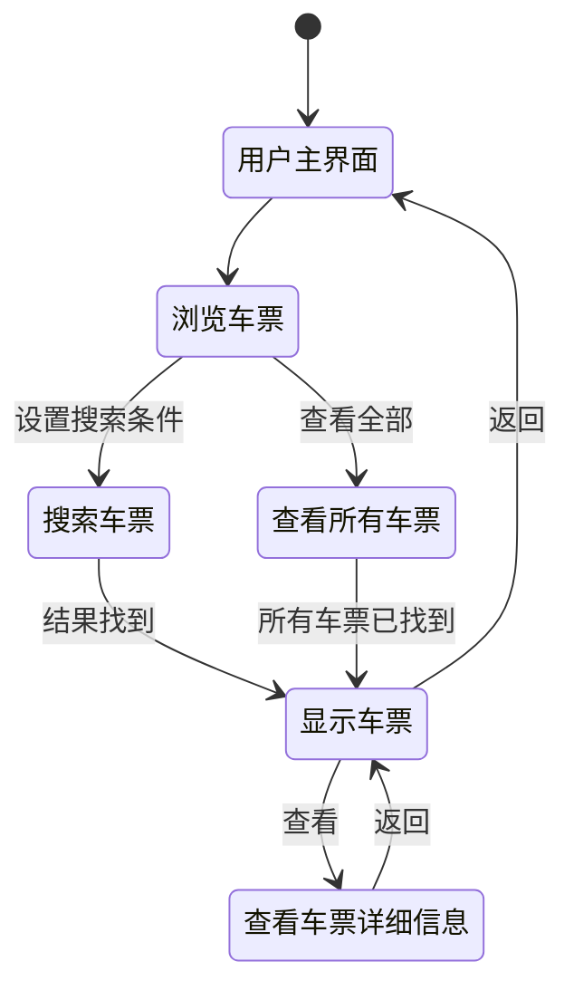
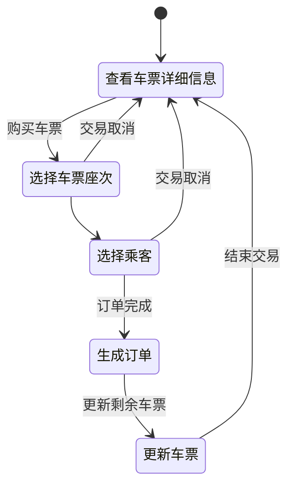
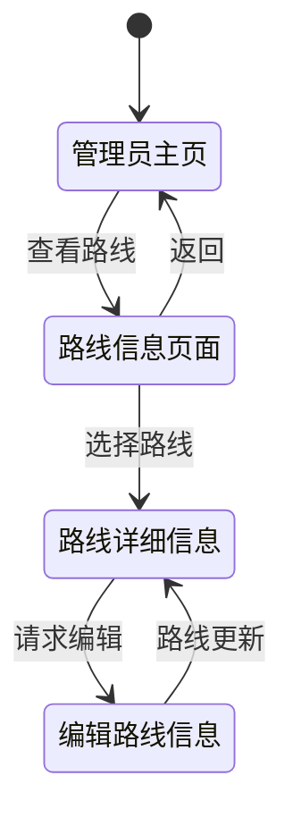
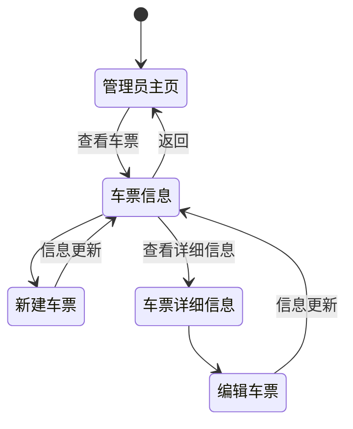

# 概念类图、系统顺序图和状态图

## 小组成员信息

第21组：

* 黄天宇 211250036
* 刘洋 211250037
* 汪华 211250038
* 陈凯权 211250026

<table>
  <tr>
  <td><b>修改人员</b></td>
    <td><b>日期</b></td>
    <td><b>变更原因</b></td>
    <td><b>版本号</b></td>
  </tr>
  <tr>
    <td>
    全体成员
    </td>
    <td>
      2023.4.11
    </td>
    <td>
      最初草稿
    </td>
    <td>
      v1.0.0
    </td>
  </tr>
   <tr>
    <td>
    陈凯权
    </td>
    <td>
      2023.4.12
    </td>
    <td>
      添加系统顺序图
    </td>
    <td>
      v1.0.1
    </td>
  </tr>
     <tr>
    <td>
    黄天宇
    </td>
    <td>
      2023.4.13
    </td>
    <td>
      添加概念类图
    </td>
    <td>
      v1.0.2
    </td>
  </tr>
     <tr>
    <td>
    黄天宇
    </td>
    <td>
      2023.4.15
    </td>
    <td>
      添加状态图
    </td>
    <td>
      v1.0.3
    </td>
  </tr>
     <tr>
    <td>
    刘洋
    </td>
    <td>
      2023.7.7
    </td>
    <td>
      针对lab7对概念类图进行修改
    </td>
    <td>
      v1.0.4
    </td>
  </tr>
    <tr>
    <td>
    刘洋
    </td>
    <td>
      2023.7.8
    </td>
    <td>
      为状态图添加了起始状态并将逻辑问题解决，添加了车票信息到管理员主页的返回、对顺序图进行了完善
    </td>
    <td>
      v1.0.5
    </td>
  </tr>
</table>

## 概念类图

## 系统顺序图

### 1. 个人基本信息管理

### 2. 浏览车票详细信息

### 3. 购买车票

### 4. 铁路信息管理

### 5. 车票信息管理

## 状态图

### 1. 个人基本信息管理

### 2. 浏览车票详细信息

### 3. 购买车票

### 4. 铁路信息管理

### 5. 车票信息管理

